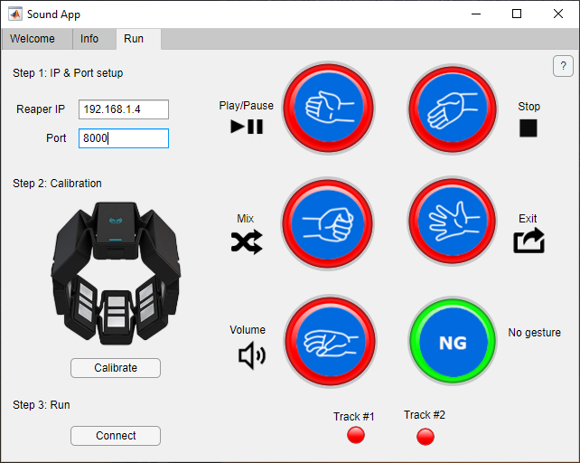
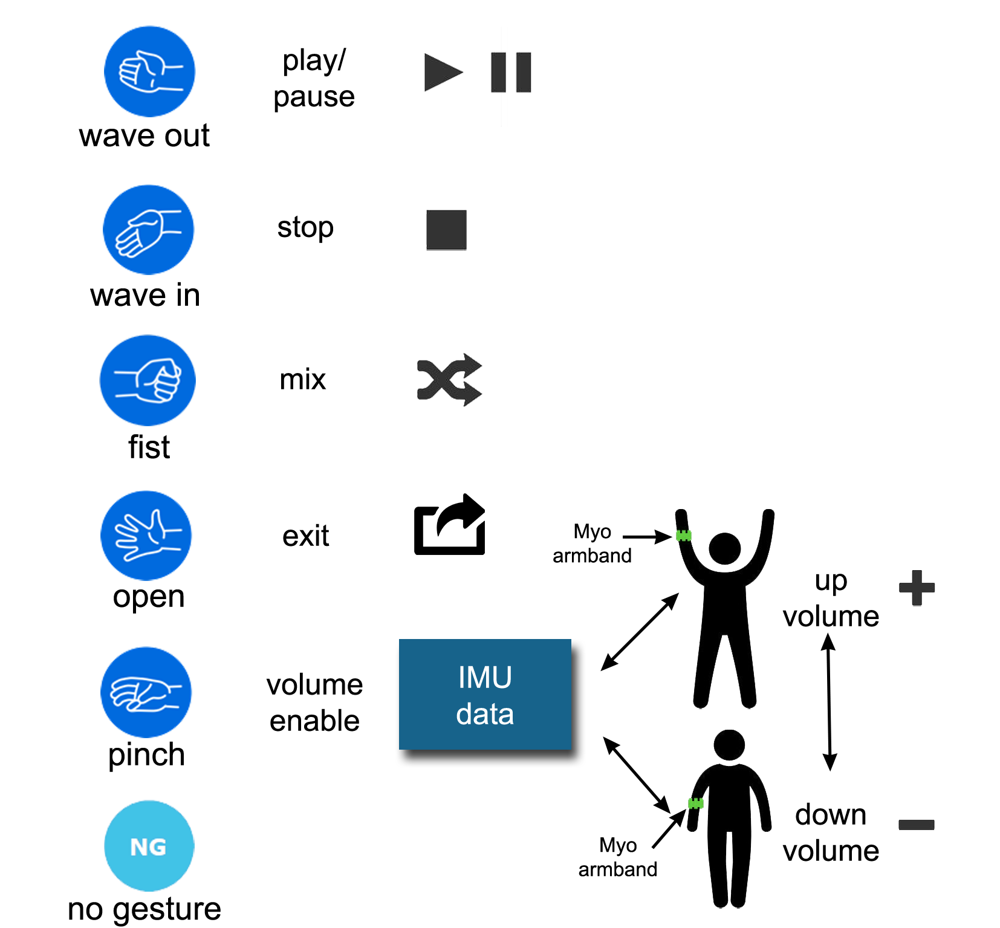

# EMG_SOUND_MIX

# Introduction
We have developed an application that uses Matlab and Reaper to interact through hand gestures.
Reaper is audio editing software.
Using a gesture recognition system developed in a previous research, we have created an application that allows you to control audio tracks through hand gestures.

## Matlab App
   

The Classifier to implement the App is located in the following link:

https://epnecuador-my.sharepoint.com/:f:/g/personal/laboratorio_ia_epn_edu_ec/EuL3UQg3QYpLmLykBM6uKDwBAGR-sUM2X_PHGyy1szgidA?e=R8D6Gd 

    
## OSC Matlab

In Reaper and Matlab, the same IP address and port number parameters must be configured. 
    
    
    
## Gestures Info
The gestures to be performed are mapped to actions in Reaper accordingly the following image
  

# Demo 
In the following link you can find a video how the system works.

https://epnecuador-my.sharepoint.com/:v:/g/personal/laboratorio_ia_epn_edu_ec/EZVv0u7iX0BEvNmOPJcuwdYB3QcH_gow1HHG-HcsoDew3w?e=ua3IMm
